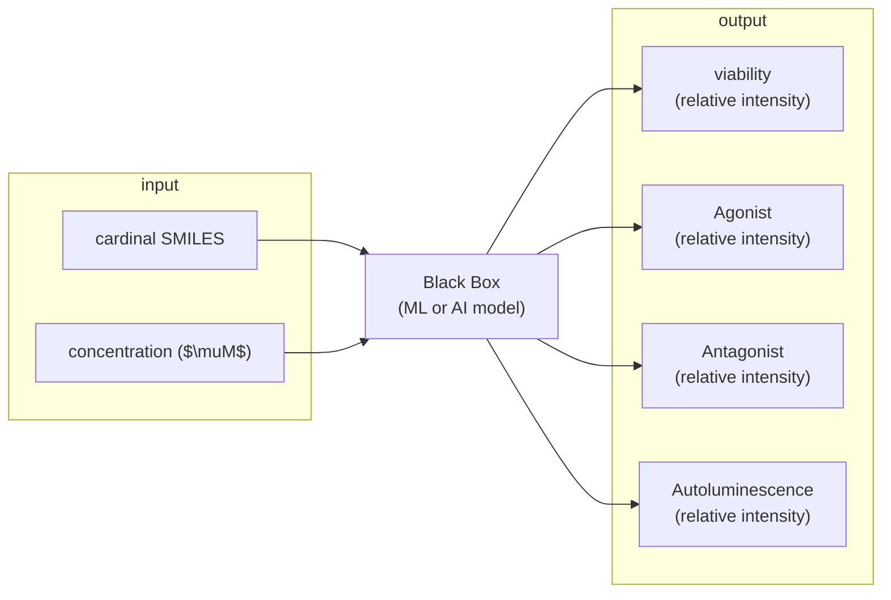

## Approaches to handle slightly different concentrations across channels
* [treating channels as separate inputs](https://www.nature.com/articles/s41467-024-55082-4), as in:
   * multi-channel model architecture (with all input concentrations for all channels, and at the end we set the desired value for all channels),
   * learning of each channel separately, followed by result aggregation, or even ensemble,
   * conditioning: using concentrations as an additional input feature,
* interpolation,
* standardization: assumption across channels, i-th CONC is the same,

## Schematic Model

