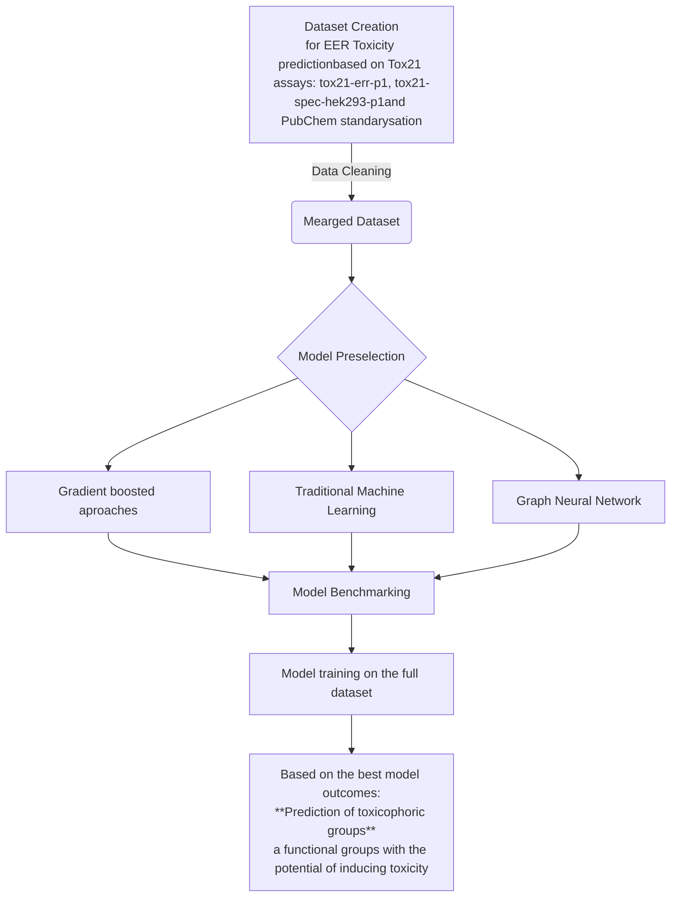

# Team9_Toxicological_Profiles

## Important Links
* link to the [dataset](https://drive.google.com/drive/folders/195KAyBS80Qdu5-uTHUWGVScDd4S7jBmM)
* [introduction to the problem](https://docs.google.com/presentation/d/1WYebbOqxnCUWdD_irGYNAFhBpz03HkJezKHb4039Ud0/edit#slide=id.g357624754e3_0_69)
* Simmilar solutions: [https://paperswithcode.com/sota/drug-discovery-on-tox21](https://paperswithcode.com/sota/drug-discovery-on-tox21)

## Dataset
### Columns Description
The [dataset](https://drive.google.com/drive/folders/195KAyBS80Qdu5-uTHUWGVScDd4S7jBmM) is based on the Tox21 Dataset merged with SMILES and IDs from Pubchem.
* **SAMPLE_DATA_TYPE**: distinguish channels:
   * *cell_red*: Autofluorescence of molecules
   * *agonist(1-3)*:
   * *antagonist(1-3)*:
   * *viability(1-3)*:<be>
where 1-3 indicates measurement repetition.

* **DATA(1-14)**: measurement of fluorescence in a specific experiment, it contains float values, positive and negative. None values indicate a lack of measurement
* **CONC(1-14)**: concentration in $\mu$M at which DATA is measured, it consists of positive float values, with None values in case of a lack of measurement
where each DATA is measured at a specific CONC indicated by id (ie, DATA1 is measured at CONC1, DATA2 is measured at CONC2, etc),

* **canonical_smiles**:
* **similarity_order**:
* **iupac_name**:

Information for tracking measurement or molecule source for data check PUBCHEM_CID, TOX21_ID, SAMPLE_NAME, PUBCHEM_SID.
* **CURVE_CLASS2**: Tox21 group description of each measurement series (DATA/CONC 1-15) based on the Hill equation or set manually.
* **PubChemFingerprint**:
* **similarity_order**:

## Alternative Solutions
Based on the [Tox21 Dataset](https://tripod.nih.gov/pubdata/) there is [Therapeutics Data Commons (TDC)](https://arxiv.org/pdf/2102.09548v2) dataset, and [Tox24 Chalange](https://ochem.eu/static/challenge-data.do) dataset.<be>
[Tox21 benchmark](https://paperswithcode.com/dataset/tox21-1):
* [XGBoost](https://arxiv.org/pdf/2204.07532v3):

Tox24:
* [Keggle competitors](https://www.kaggle.com/datasets/antoninadolgorukova/tox24-challenge-data/code)
* [XGBoost](https://arxiv.org/pdf/2204.07532v3):
  * Features:
    1. Fingerprints: ErG, Mordred, Pubchem, MACCS, RDKit
    2. Fingerprints: 'fgr', 'datamol', 'ALogPSOEState', 'Mold2', 'SIRMSmix', 'MAP4', 'atombond', 'estate', 'JPlogP', 'ISIDAfragments'
  * algorithms:
    1. Cross-validation using XGBoost
    2. XGBoost

[Best TDC models according to Papers With Code](https://paperswithcode.com/dataset/tdcommons):
* [MapLight](https://arxiv.org/pdf/2310.00174v1)
  * Features:
    1. fingerprints: extended-connectivity fingerprints (ECFP), Avalon, and extended reduced graph approach (ErG),
    2. 200 molecular properties, including: "number of rings, molecular weight"
  * algorithms:
    1. Parameter search via grid search CV,
    2. CatBoost,
    3. LightGBM
* [XGBoost](https://arxiv.org/pdf/2204.07532v3):
  * Features:
    1. Fingerprints: MACCS, ECFP, Mol2Vec,
    2. Descriptors: Pubchem (881 distinct structural features), Molecular Access System (Mordred), RDKit
  * algorithms:
    1. Parameter search via randomized grid search CV,
    2. Extreme Gradient Boosting (XGBoost)

